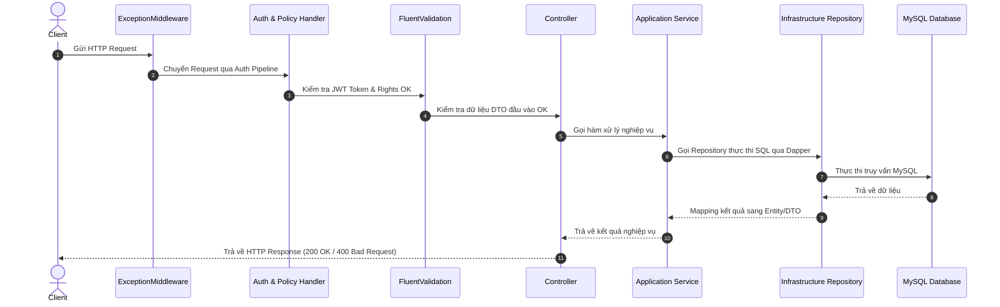

# Tài liệu Kiến trúc & Chi tiết Tầng API (EmployeeManagement.Api)

## 📌 1. Tổng quan về Tầng API (Presentation Layer)

Trong kiến trúc **Clean Architecture**, **Tầng API (`EmployeeManagement.Api`)** đóng vai trò là **Presentation Layer** (tầng giao tiếp ngoài cùng của ứng dụng Backend). 

Tầng này chịu trách nhiệm:
1. **Lắng nghe & Tiếp nhận:** Tiếp nhận các HTTP Request (`GET`, `POST`, `PUT`, `DELETE`, `PATCH`) từ Client (Web Frontend, Mobile App, Postman, Swagger UI).
2. **Xác thực & Phân quyền:** Kiểm tra danh tính người dùng (JWT Token) và phân quyền truy cập (`Admin` hay `Employee`).
3. **Định tuyến (Routing):** Điều hướng Request đến đúng Controller và Action Method tương ứng.
4. **Gọi tầng Application:** Chuyển giao dữ liệu đầu vào (DTO) xuống tầng `Application` để xử lý nghiệp vụ.
5. **Phản hồi (Response):** Đóng gói kết quả và trả về HTTP Response với các Status Code chuẩn (`200 OK`, `400 Bad Request`, `401 Unauthorized`, `404 Not Found`, `500 Internal Server Error`).
6. **Bắt lỗi toàn cục:** Bắt và xử lý tập trung các ngoại lệ phát sinh (Exceptions) để ứng dụng không bị sập.

---

## 🗂️ 2. Cấu trúc Thư mục & Tập tin Tầng API

```text
src/Api/
 ├── Authentication/
 │    ├── AuthorizationPolicies.cs
 │    └── BearerAuthenticationHandler.cs
 ├── Controllers/
 │    ├── AuthController.cs
 │    ├── DashboardController.cs
 │    ├── DepartmentsController.cs
 │    ├── EmployeesController.cs
 │    ├── PositionsController.cs
 │    ├── ProfileController.cs
 │    ├── UsersController.cs
 │    └── WeatherForecastController.cs
 ├── Extensions/
 │    ├── ValidationExtensions.cs
 │    └── ValidationServiceExtensions.cs
 ├── Middleware/
 │    └── ExceptionMiddleware.cs
 ├── Properties/
 │    └── launchSettings.json
 ├── appsettings.Development.json
 ├── appsettings.json
 ├── EmployeeManagement.Api.csproj
 ├── EmployeeManagement.Api.http
 ├── Program.cs
 └── WeatherForecast.cs
```

---

## 🚀 3. Chi tiết các File Cấu hình & Khởi chạy (Root)

### 3.1 `Program.cs`
* **Vai trò:** Trái tim khởi chạy của toàn bộ ứng dụng Web API.
* **Chức năng chính:**
  - Khởi tạo `WebApplicationBuilder`.
  - Khai báo và đăng ký các dịch vụ vào Dependency Injection (DI) Container (ví dụ: `IAuthService`, `IUserRepository`, `IEmployeeRepository`, `IDbConnectionFactory`).
  - Cấu hình Logging tập trung bằng **Serilog** (ghi log ra Console & File `Logs/log-.txt`).
  - Đăng ký Authentication, Authorization và Swagger Gen.
  - Cấu hình HTTP Request Pipeline (đăng ký `ExceptionMiddleware`, `app.UseAuthentication()`, `app.UseAuthorization()`, `app.MapControllers()`).

### 3.2 `appsettings.json`
* **Vai trò:** File chứa các thông số cấu hình môi trường tĩnh.
* **Nội dung:**
  - `ConnectionStrings:DefaultConnection`: Chuỗi kết nối đến MySQL Database.
  - `Jwt`: Khóa bí mật (`Key`), `Issuer`, `Audience`, thời gian hết hạn Token (`ExpiresInMinutes`).
  - `Logging`: Cấu hình mức độ ghi log mặc định.

### 3.3 `appsettings.Development.json`
* **Vai trò:** Chứa cấu hình ghi đè dành riêng cho môi trường phát triển (Development).

### 3.4 `EmployeeManagement.Api.csproj`
* **Vai trò:** File cấu hình dự án .NET.
* **Nội dung:** Khai báo `net8.0`, tham chiếu dự án tầng `Application` và `Infrastructure`, khai báo các thư viện NuGet (`Swashbuckle.AspNetCore`, `Serilog.AspNetCore`, `FluentValidation.AspNetCore`,...).

---

## 🎮 4. Chi tiết các Controllers (`src/Api/Controllers/`)

Tất cả các Controller đều kế thừa từ `ControllerBase` và được đánh dấu thuộc tính `[ApiController]` cùng `[Route("api/[controller]")]`.

### 4.1 `AuthController.cs`
* **Đường dẫn gốc:** `/api/auth`
* **Nhiệm vụ:** Xử lý xác thực người dùng và cấp phát Token.
* **Danh sách Endpoints:**
  - `POST /api/auth/register`: Đăng ký tài khoản người dùng mới.
  - `POST /api/auth/login`: Đăng nhập, xác thực BCrypt và trả về JWT Access Token & Refresh Token.
  - `POST /api/auth/refresh-token`: Cấp Access Token mới từ Refresh Token.
  - `POST /api/auth/logout`: Đăng xuất tài khoản.
  - `POST /api/auth/change-password`: Đổi mật khẩu cho người dùng hiện tại.
  - `POST /api/auth/forgot-password`: Yêu cầu gửi mã OTP quên mật khẩu.

### 4.2 `EmployeesController.cs`
* **Đường dẫn gốc:** `/api/employees`
* **Nhiệm vụ:** Quản lý danh sách và thông tin nhân viên.
* **Danh sách Endpoints:**
  - `GET /api/employees`: Lấy danh sách nhân viên (hỗ trợ phân trang, tìm kiếm theo tên/email/phone, lọc theo phòng ban/chức vụ/trạng thái).
  - `GET /api/employees/{id}`: Xem chi tiết thông tin 1 nhân viên.
  - `POST /api/employees`: Thêm mới nhân viên (tự động sinh mã `EMP...`, chỉ Admin).
  - `PUT /api/employees/{id}`: Cập nhật thông tin nhân viên (chỉ Admin).
  - `DELETE /api/employees/{id}`: Xóa mềm nhân viên (`IsDeleted = 1`, chỉ Admin).
  - `PATCH /api/employees/{id}/restore`: Khôi phục nhân viên đã xóa mềm (chỉ Admin).

### 4.3 `DepartmentsController.cs`
* **Đường dẫn gốc:** `/api/departments`
* **Nhiệm vụ:** Quản lý danh mục Phòng ban (`CRUD`). Yêu cầu quyền `AdminOnly`.

### 4.4 `PositionsController.cs`
* **Đường dẫn gốc:** `/api/positions`
* **Nhiệm vụ:** Quản lý danh mục Chức vụ (`CRUD`). Yêu cầu quyền `AdminOnly`.

### 4.5 `ProfileController.cs`
* **Đường dẫn gốc:** `/api/profile`
* **Nhiệm vụ:** Cho phép nhân viên xem (`GET`) và cập nhật thông tin cá nhân (`PUT`) của chính mình.

### 4.6 `DashboardController.cs`
* **Đường dẫn gốc:** `/api/dashboard`
* **Nhiệm vụ:** Cung cấp API báo cáo thống kê số liệu tổng quan cho Admin (Tổng nhân viên, đang làm, nghỉ việc, nhân viên mới trong tháng, nhân viên theo phòng ban/chức vụ).

### 4.7 `UsersController.cs`
* **Đường dẫn gốc:** `/api/users`
* **Nhiệm vụ:** Quản lý danh sách tài khoản User hệ thống dành cho Admin (`CRUD`).

---

## 💡 5. Cơ chế Routing (Định tuyến API) trong Controller

ASP.NET Core sử dụng **Attribute Routing** để tự động ghép nối đường dẫn:

```csharp
[ApiController]
[Route("api/[controller]")] // [controller] tự động lấy tên Class bỏ đuôi "Controller" => "auth"
public class AuthController : ControllerBase
{
    [HttpPost("register")] // Ghép với /api/auth => /api/auth/register
    public async Task<IActionResult> Register(...) { ... }
}
```

---

## 🛡️ 6. Các Thành phần Xác thực, Phân quyền & Middleware

### 6.1 `BearerAuthenticationHandler.cs` (`src/Api/Authentication/`)
* Bộ xử lý tùy biến (Custom Authentication Handler) kiểm tra Header `Authorization: Bearer <token>` từ HTTP Request, giải mã Token và gán đối tượng danh tính `ClaimsPrincipal` vào `HttpContext.User`.

### 6.2 `AuthorizationPolicies.cs` (`src/Api/Authentication/`)
* Định nghĩa các quy tắc phân quyền:
  - `AdminOnly`: Yêu cầu Role là `ADMIN`.
  - `EmployeeOrAdmin`: Yêu cầu Role là `ADMIN` hoặc `EMPLOYEE`.

### 6.3 `ExceptionMiddleware.cs` (`src/Api/Middleware/`)
* Middleware xử lý ngoại lệ tập trung (Global Exception Handler).
* Khi ứng dụng gặp sự cố/crash bất kỳ đâu, Middleware này sẽ chặn lại, ghi log lỗi ra Serilog và trả về kết quả JSON HTTP 500 chuẩn cho client mà không bị crash server.

### 6.4 `ValidationServiceExtensions.cs` (`src/Api/Extensions/`)
* Đăng ký tự động kiểm tra dữ liệu đầu vào (FluentValidation) trước khi Request đi vào trong Controller.

---

## 🔄 7. Luồng Xử lý một HTTP Request (Request Flow)


